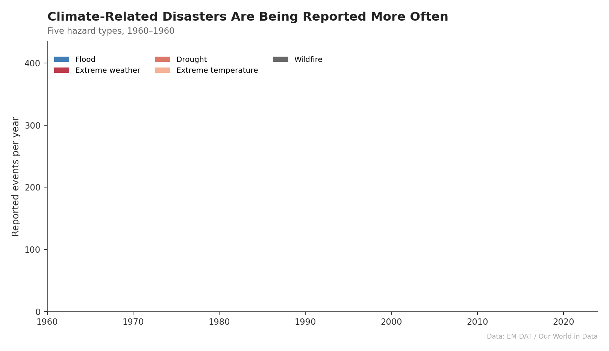
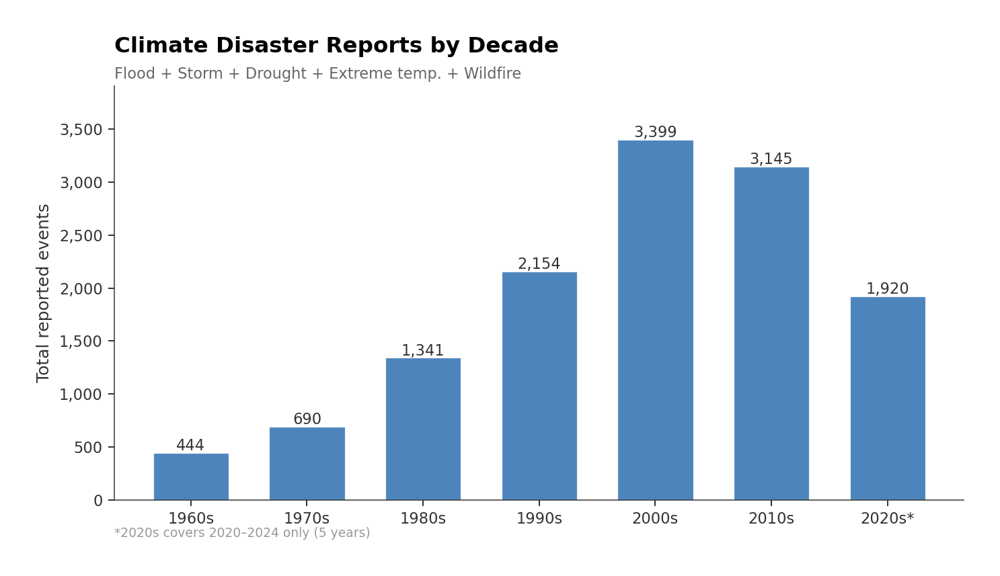
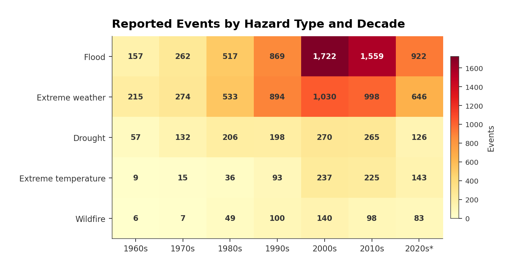
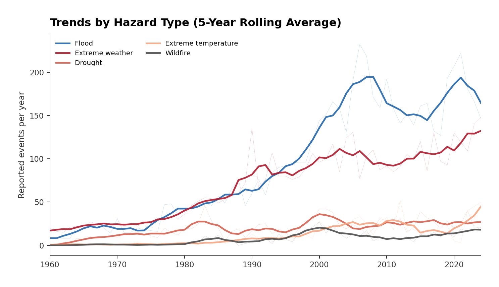

# Climate Disaster Trends

An animated data story showing how reported weather and climate disasters have changed from 1960 to 2024.



## Why I made this

Disaster statistics usually live in dense tables or static bar charts that don't reveal much about *how* the picture has shifted over time. I wanted to turn the same numbers into something you can actually watch unfold, an animation that makes the growth in reported disasters hard to ignore, while still being honest about what the data can and can't tell us.

The project is built around one question: **have weather-related disaster reports changed over the past six decades, and which types have changed the most?**

## Dataset

The data comes from [EM-DAT](https://www.emdat.be/) (the International Disasters Database), accessed through [Our World in Data](https://ourworldindata.org/natural-disasters). It counts the number of globally reported disaster events per year, broken down by hazard type.

I filtered it to five climate/weather-related categories: **flood**, **extreme weather** (storms, cyclones, etc.), **drought**, **extreme temperature**, and **wildfire**. I dropped earthquakes, volcanic activity, and mass movements since those aren't driven by climate.

See [`data/README.md`](data/README.md) for full details on what counts as a "disaster" in EM-DAT and the known limitations.

## What the project does

The script downloads the data, cleans it and produces:

1. **An animated stacked area chart** (GIF) showing how each hazard type contributes to the rising total over time. Key moments are annotated.
2. **A decade bar chart** — total climate disaster reports per decade.
3. **A heatmap** — hazard type vs. decade, making it easy to spot which categories grew the fastest.
4. **A smoothed line chart** — 5-year rolling averages for each hazard type, with the raw yearly data faintly visible behind.
5. **A summary CSV** with totals, shares, peak decades, and early vs. recent averages per hazard type.

## Example outputs

### Total events by decade


### Heatmap: hazard type × decade


### Individual hazard trends


## How to run

```bash
git clone https://github.com/YOUR_USERNAME/climate-disaster-trends.git
cd climate-disaster-trends
pip install -r requirements.txt
python disaster_trends.py
```

The script takes about 30–60 seconds. All outputs go to `figures/` and `outputs/`. It creates those folders if they don't exist.

The dataset is included in `data/` so no internet connection or API key is needed.

## Method

1. Load the Our World in Data disaster events CSV.
2. Filter to the five climate-related hazard types.
3. Keep 1960–2024 — earlier records are too patchy to be meaningful.
4. Pivot the data into a year × hazard matrix, filling gaps with zero.
5. Build an animated stacked area chart frame by frame, saving as GIF.
6. Aggregate by decade for the static summary charts.
7. Export a summary table comparing each hazard type.

Grouping by decade smooths the noise and makes long-term patterns easier to read than noisy year-by-year counts.

## Key findings

- **Reported climate disasters have grown roughly 8× since the 1960s.** The 1960s saw ~444 total events; the 2000s peaked at ~3,400.
- **Floods dominate**, making up 46% of all events. They've risen from ~16/year in the 1960s to ~170/year in recent years.
- **Extreme weather (storms)** is the second-largest category at 35% of events. Reports roughly tripled from the 1980s to the 2000s.
- **Extreme temperature events** barely registered before the 1980s but have climbed steeply — averaging ~23 per year in the 2010s vs. fewer than 1 per year in the 1960s.
- **Wildfire reports** are small in absolute numbers but have roughly doubled every decade since the 1970s.
- The 2000s were the peak decade across all five categories. The 2010s and early 2020s remain near that level.

## Limitations

These numbers need to be read carefully:

- **More reports ≠ more physical events.** Disaster recording has improved dramatically. Countries report more consistently now, satellite monitoring catches more events, and population growth means more people are exposed. The upward trend is partly, perhaps largely, a measurement effect.
- **No severity weighting.** A single localised flood and a catastrophic multi-nation event both count as one.
- **Older data is patchy.** Pre-1960 records are sparse enough that I excluded them entirely. Even the 1960s are probably underreported.
- **Definitional grey areas.** The boundary between "flood" and "extreme weather" isn't always clear, and classification practices have shifted.
- **The 2020s are incomplete.** Only 2020–2024 data is available, so decade totals aren't directly comparable.

None of this means the trends are meaningless, but separating the climate signal from the reporting signal can be difficult and this project doesn't try to do that.

## Future improvements

- Add death toll and economic damage data for a severity dimension.
- Break down by region (EM-DAT has continent-level data) to see where growth is concentrated.
- Normalise by population or GDP to get closer to a per-capita risk measure.
- Overlay global temperature anomaly data to see if disaster reports track warming.
- Build an interactive version with Plotly or D3 for exploring individual years.

## Contact
Any feedback is welcome and encouraged!
- **Find me on:** [LinkedIn](https://www.linkedin.com/in/amy-ariyo-5882ab219)

Data: EM-DAT/Our World in Data.
